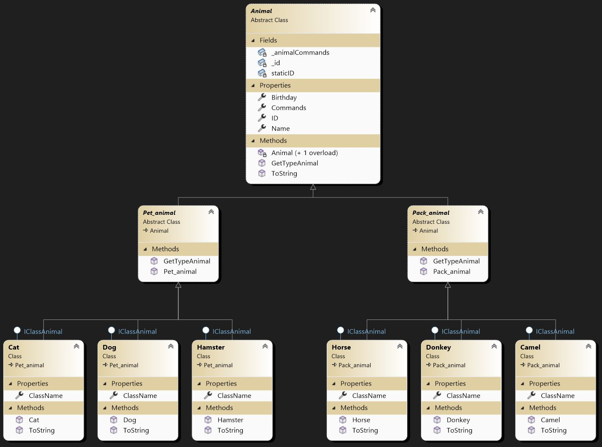

# Итоговая контрольная работа по блоку специализация

## Задание
1. Используя команду cat в терминале операционной системы Linux, создать
два файла Домашние животные (заполнив файл собаками, кошками,
хомяками) и Вьючные животными заполнив файл Лошадьми, верблюдами и
ослы), а затем объединить их. Просмотреть содержимое созданного файла.
Переименовать файл, дав ему новое имя (Друзья человека).

``` bash
cat "домашние животные"
собака
кошка
хомяк

cat > "вьючные животные"
лошадь
верблюд
осел

# Объединим файлы:
cat "домашние животные" "вьючные животные" > "животные" 
# Просмотрим содержимое нового файла
cat "животные"
# Переименуем файл
mv "животные" "друзья человека"
```

2. Создать директорию, переместить файл туда.

``` bash
mkdir Зоопарк
mv "друзья человека" ./Зоопарк/
```

3. Подключить дополнительный репозиторий MySQL. Установить любой пакет из этого репозитория.

``` bash
# подключим MySQL APT репозиторий согласно рекомендуемой инструкции:
curl -fsSL https://dev.mysql.com/get/mysql-apt-config_0.8.24-1_all.deb -o mysql-apt-config_0.8.24-1_all.deb
sudo dpkg -i mysql-apt-config_0.8.24-1_all.deb
sudo apt-get update
# установим пакет mysql-server
sudo apt-get install mysql-server
```

4. Установить и удалить deb-пакет с помощью dpkg.

``` bash
# установим Nginx
# скачаем deb - пакет
curl -fsSL https://nginx.org/packages/ubuntu/pool/nginx/n/nginx/nginx_1.22.1-1~jammy_amd64.deb -o nginx_1.22.1-1-jammy_amd64.deb
# установим deb - пакет
sudo dpkg -i nginx_1.22.1-1-jammy_amd64.deb
sudo apt update
# удалим пакет
sudo dpkg -r nginx
```

5. Выложить историю команд в терминале ubuntu

``` bash
history

  962  cat > "домашние животные"
  963  cat "домашние животные"
  964  cat > "вьючные животные"
  965  cat "домашние животные" "вьючные животные" > "животные"
  966  cat "животные"
  967  mv "животные" "друзья человека"
  968  cat "друзья человека"
  969  mkdir Зоопарк
  970  mv "друзья человека" ./Зоопарк/
  971  cat ./Зоопарк/"друзья человека"
  972  cd Зоопарк/
  973  cat "друзья человека"
  974  curl -fsSL https://dev.mysql.com/get/mysql-apt-config_0.8.24-1_all.deb -o mysql-apt-config_0.8.24-1_all.deb
  975  ll
  976  sudo dpkg -i mysql-apt-config_0.8.24-1_all.deb
  977  sudo apt-get update
  978  sudo apt-get install mysql-server
  979  sudo dpkg -i nginx_1.22.1-1~jammy_amd64.deb
  980  sudo apt update
  981  curl -fsSL https://nginx.org/packages/ubuntu/pool/nginx/n/nginx/nginx_1.22.1-1~jammy_amd64.deb -o nginx_1.22.1-1-jammy_amd64.deb
  982  sudo dpkg -i nginx_1.22.1-1-jammy_amd64.deb
  983  dpkg -l
  984  sudo dpkg -r nginx
  985  sudo apt update
  986  history
```

6. Нарисовать диаграмму, в которой есть класс родительский класс, домашние
животные и вьючные животные, в составы которых в случае домашних
животных войдут классы: собаки, кошки, хомяки, а в класс вьючные животные
войдут: Лошади, верблюды и ослы).



7. В подключенном MySQL репозитории создать базу данных “Друзья человека”
``` SQL
DROP DATABASE IF EXISTS human_friends;
CREATE DATABASE human_friends;
```

8. Создать таблицы с иерархией из диаграммы в БД
``` SQL
USE human_friends;

CREATE TABLE animal_type( -- тут описываем типы животных: домашние животные, вьючные животные...
  id SERIAL PRIMARY KEY, -- SERIAL = BIGINT UNSIGNED NOT NULL AUTO_INCREMENT UNIQUE
  name VARCHAR(100)  -- название типа (домашние животные, вьючные животные...)
);

CREATE TABLE animals( -- таблица со всеми животными
  id SERIAL PRIMARY KEY, -- SERIAL = BIGINT UNSIGNED NOT NULL AUTO_INCREMENT UNIQUE
  name VARCHAR(100), -- имя животного
  birthday DATE,     -- день рождения
  command VARCHAR(100), -- выполняемая команда
  from_animal_type_id BIGINT UNSIGNED NOT NULL, -- ссылаемся на тип животного
  FOREIGN KEY (from_animal_type_id) REFERENCES animal_type(id) ON UPDATE CASCADE ON DELETE CASCADE
);

CREATE TABLE horses( -- таблица лошадей
  id SERIAL PRIMARY KEY, -- SERIAL = BIGINT UNSIGNED NOT NULL AUTO_INCREMENT UNIQUE
  from_animals_id BIGINT UNSIGNED NOT NULL, 
  FOREIGN KEY (from_animals_id) REFERENCES animals(id) ON UPDATE CASCADE ON DELETE CASCADE
);

CREATE TABLE dogs( -- таблица собак
  id SERIAL PRIMARY KEY, -- SERIAL = BIGINT UNSIGNED NOT NULL AUTO_INCREMENT UNIQUE
  from_animals_id BIGINT UNSIGNED NOT NULL, 
  FOREIGN KEY (from_animals_id) REFERENCES animals(id) ON UPDATE CASCADE ON DELETE CASCADE
);

CREATE TABLE cats( -- таблица собак
  id SERIAL PRIMARY KEY, -- SERIAL = BIGINT UNSIGNED NOT NULL AUTO_INCREMENT UNIQUE
  from_animals_id BIGINT UNSIGNED NOT NULL, 
  FOREIGN KEY (from_animals_id) REFERENCES animals(id) ON UPDATE CASCADE ON DELETE CASCADE
);

CREATE TABLE camels( -- таблица верблюдов
  id SERIAL PRIMARY KEY, -- SERIAL = BIGINT UNSIGNED NOT NULL AUTO_INCREMENT UNIQUE
  from_animals_id BIGINT UNSIGNED NOT NULL, 
  FOREIGN KEY (from_animals_id) REFERENCES animals(id) ON UPDATE CASCADE ON DELETE CASCADE
);

CREATE TABLE donkeys( -- таблица ослов
  id SERIAL PRIMARY KEY, -- SERIAL = BIGINT UNSIGNED NOT NULL AUTO_INCREMENT UNIQUE
  from_animals_id BIGINT UNSIGNED NOT NULL, 
  FOREIGN KEY (from_animals_id) REFERENCES animals(id) ON UPDATE CASCADE ON DELETE CASCADE
);

CREATE TABLE hamsters( -- таблица хомяков
  id SERIAL PRIMARY KEY, -- SERIAL = BIGINT UNSIGNED NOT NULL AUTO_INCREMENT UNIQUE
  from_animals_id BIGINT UNSIGNED NOT NULL, 
  FOREIGN KEY (from_animals_id) REFERENCES animals(id) ON UPDATE CASCADE ON DELETE CASCADE
);
```

9. Заполнить низкоуровневые таблицы именами(животных), командами которые они выполняют и датами рождения

``` SQL
-- заполним таблицу типов животных:
INSERT INTO `animal_type` (`id`, `name`) VALUES (1, 'домашние животные');
INSERT INTO `animal_type` (`id`, `name`) VALUES (2, 'вьючные животные');
-- заполним основную таблицу с животными:
INSERT INTO `animals` (`name`, `birthday`, `command`, `from_animal_type_id`) VALUES
  ('Борис',   '2021-04-01', 'лай',      '1'),
  ('Хомка',   '2022-07-06', 'щеки',     '1'),
  ('Иа',      '2020-03-25', 'иа',       '2'),
  ('Бенефис', '2021-08-24', 'и-го-го',  '2'),
  ('Мурка',   '2018-10-07', 'мяу',      '1'),
  ('Васька',  '2020-12-15', 'мау',      '1'),
  ('Степа',   '2017-02-22', 'и-го-го',  '2'),
  ('Руслан',  '2015-11-13', 'тьфу',     '2'),
  ('Амур',    '2013-05-14', 'иа',       '2'),
  ('Леша',    '2018-04-12', 'тьфу',     '2'),
  ('Тим',     '2018-06-17', 'щеки',     '1'),
  ('Эфес',    '2015-01-09', 'лай',      '1');

INSERT INTO `camels`    (`from_animals_id`) VALUES ('8'), ('10');  -- заполним таблицу верблюдов
INSERT INTO `cats`      (`from_animals_id`) VALUES ('5'), ('6');   -- заполним таблицу кошек
INSERT INTO `dogs`      (`from_animals_id`) VALUES ('1'), ('12');  -- заполним таблицу собак
INSERT INTO `donkeys`   (`from_animals_id`) VALUES ('4'), ('7');   -- заполним таблицу ослов
INSERT INTO `hamsters`  (`from_animals_id`) VALUES ('2'), ('11');  -- заполним таблицу хомяков
INSERT INTO `horses`    (`from_animals_id`) VALUES ('3'), ('9');   -- заполним таблицу лошадей
```

10. Удалив из таблицы верблюдов, т.к. верблюдов решили перевезти в другой питомник на зимовку. Объединить таблицы лошади, и ослы в одну таблицу.

``` SQL
DELETE FROM `animals` WHERE `id` IN (SELECT `from_animals_id` FROM `camels`); -- удаляем верблюдов из основной таблицы
-- Объединить таблицы лошади (`horses`), и ослы (`donkeys`) в одну таблицу (`horses_donkeys`):
CREATE TABLE `horses_donkeys` SELECT * FROM (
  SELECT `from_animals_id` FROM `horses`
  UNION
  SELECT `from_animals_id` FROM `donkeys`) hd;
```

11. Создать новую таблицу “молодые животные” в которую попадут все животные старше 1 года, но младше 3 лет и в отдельном столбце с точностью до месяца подсчитать возраст животных в новой таблице
``` SQL
CREATE TABLE `young_animals`
	SELECT *, TIMESTAMPDIFF(MONTH, birthday,current_date()) as `age_months` 
    FROM animals 
    WHERE TIMESTAMPDIFF(YEAR, birthday,current_date()) BETWEEN 1 AND 3;
```

12. Объединить все таблицы в одну, при этом сохраняя поля, указывающие на прошлую принадлежность к старым таблицам.

``` SQL
SELECT `from_animals_id`, "camels" as `from_table` FROM `camels` UNION
	SELECT `from_animals_id`, "cats" as `from_table` FROM `cats` UNION
  SELECT `from_animals_id`, "dogs" as `from_table` FROM `dogs` UNION
  SELECT `from_animals_id`, "donkeys" as `from_table` FROM `donkeys` UNION
  SELECT `from_animals_id`, "hamsters" as `from_table` FROM `hamsters`;
```

---

13. Создать класс с Инкапсуляцией методов и наследованием по диаграмме.
14. Написать программу, имитирующую работу реестра домашних животных.
В программе должен быть реализован следующий функционал:
- завести новое животное
- определять животное в правильный класс
- увидеть список команд, которое выполняет животное
- обучить животное новым командам
- реализовать навигацию по меню.
15. Создайте класс Счетчик, у которого есть метод add(), увеличивающий̆ значение внутренней int переменной на 1 при нажатии “Завести новое животное” Сделайте так, чтобы с объектом такого типа можно было работать в блоке try-with-resources. Нужно бросить исключение, если работа с объектом типа счетчик была не в ресурсном try и/или ресурс остался открыт. Значение считать в ресурсе try, если при заведении животного заполнены все поля.